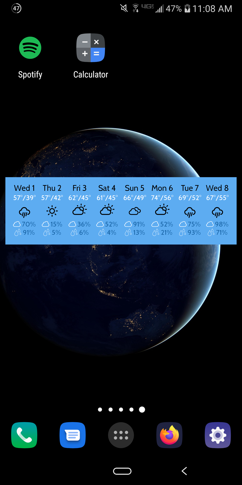

# Dark Sky Weather Widget

This is an Android widget that displays data from the Dark Sky API. The user must enter their API key and location to use the widget.

*Note: the Dark Sky API could be changing soon: 
"Our API service for existing customers is not changing today, but we will no longer accept new signups. The API will continue to function through the end of 2021." (3/31/2020)*

[Powered by Dark Sky](https://darksky.net/poweredby/ "Powered by Dark Sky")
